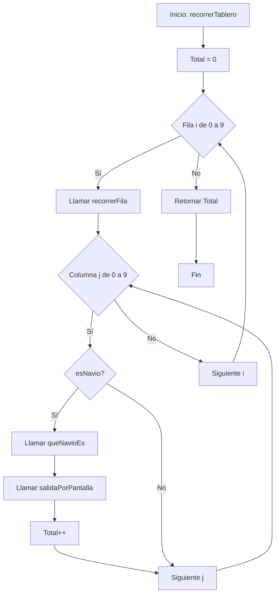
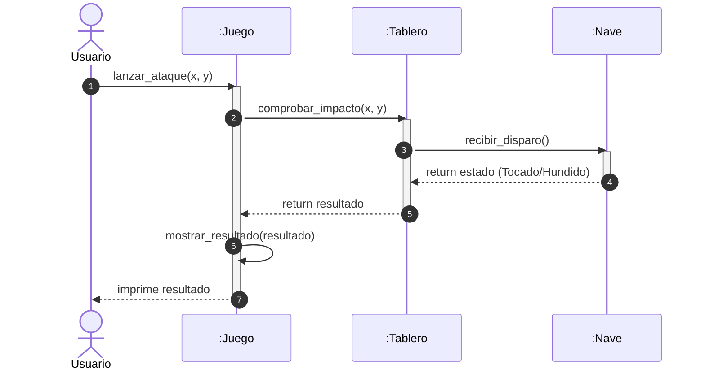

# Actividad: Hundimiento a la Flota en Python

## Parte 1: Programación Estructurada (Repaso)
En esta fase, adaptamos el ejercicio original a Python, mejorando la legibilidad y utilizando funciones con parámetros claros.

### Enunciado
Realiza un programa que recorra un tablero de 10x10. El programa debe identificar qué casillas están ocupadas y de qué barco se trata.

#### Especificaciones:
- **Tablero:** Matriz 10x10 definida en el main.
- **Valores:**
  - 0 (Agua)
  - 1 (Submarino)
  - 2 (Buque)
  - 4 (Portaaviones)
- **Funciones requeridas:**
  - `recorrerTablero(tablero)`: Devuelve el total de partes de naves.
  - `recorrerFila(fila)`: Devuelve el total de partes de naves en una fila.
  - `esNavio(valor)`: Devuelve True si el valor es > 0.
  - `queNavioEs(valor)`: Devuelve el nombre del barco como String.
  - `salidaPorPantalla(coord_x, coord_y, nombre)`: Imprime el resultado.

<details>
<summary>📊 Diagrama de Flujo (Lógica de Recorrido)</summary>



</details>

---

## Parte 2: El Salto a Objetos

### Título: "Sistemas Complejos: Del Dato al Objeto"

### Objetivos de Aprendizaje
- Identificar entidades (Clases) y sus estados (Atributos).
- Comprender la comunicación entre objetos mediante el Diagrama de Secuencia.
- Implementar lógica de negocio encapsulada.
- [Guía](Guia.md) sobre objetos en python

#### 1. Modelado y Abstracción 
En lugar de ver números en una matriz, definir:
- **Clase Nave** (`nave.py`): Representa un barco con atributos (`nombre`, `tamano`). Métodos: `recibir_disparo()`.
- **Clase Tablero** (`tablero.py`): Gestiona una matriz de casillas. Métodos: `colocar_nave()`, `comprobar_impacto()`.
- **Clase Juego** (`juego.py`): Controlador principal del juego. Métodos: `inicializar_naves()`, `lanzar_ataque()`, `mostrar_resultado()`.

#### 2. Diseño: El Diagrama de Secuencia
Diseñar el flujo de un Ataque.
- Muestra cómo el usuario envía una coordenada al Juego, cómo este delega al Tablero para comprobar impacto, y cómo el Tablero notifica a la Nave.

<details>
<summary>🔄 Diagrama de Secuencia (Flujo de Ataque)</summary>



</details>

#### 3. Implementación en Python
El código está organizado en módulos separados:

**📁 Estructura de archivos:**
- `nave.py` - Define la clase Nave
- `tablero.py` - Define la clase Tablero 
- `juego.py` - Define la clase Juego (controlador principal)

**🔧 Flujo de implementación:**
1. **Crear instancias de barcos:** Cada nave se instancia con su nombre y tamaño
   ```python
   submarino = Nave("Submarino", 1)
   buque = Nave("Buque", 2)
   portaaviones = Nave("Portaaviones", 4)
   ```

2. **Inicializar el tablero:** Se crea una matriz vacía de 10x10
   ```python
   tablero = Tablero(10)
   ```

3. **Colocar naves en el tablero:** Se vinculan las naves a coordenadas específicas
   ```python
   tablero.colocar_nave(submarino, 0, 0, "H")
   tablero.colocar_nave(buque, 5, 3, "V")
   ```

4. **Procesar disparos:** Se detecta si un barco ha sido hundido cuando `vida == 0`
   ```python
   juego.lanzar_ataque(x, y)  # Llama a comprobar_impacto() y recibir_disparo()
   ```

### Tarea Final (solamente realizarla después de acabar el diseño de objetos y secuencia)
> Implementa la lógica completa de los métodos en las clases. Actualmente solo tienen las cabeceras (firmas) con `pass`:
> 
> **En `nave.py`:**
> - `recibir_disparo()`: Debe reducir la vida de la nave y retornar "Tocado" o "Hundido"
> 
> **En `tablero.py`:**
> - `colocar_nave()`: Debe marcar las casillas ocupadas por la nave según orientación
> - `comprobar_impacto()`: Debe verificar si hay nave en las coordenadas y llamar a `recibir_disparo()`
> 
> **En `juego.py`:**
> - `inicializar_naves()`: Debe crear las naves y colocarlas en el tablero
> - `lanzar_ataque()`: Debe coordinar el disparo llamando a `comprobar_impacto()` del tablero
> - `mostrar_resultado()`: Debe imprimir el resultado por pantalla. Si es "Hundido", mostrar: `'¡Hundido! Has destruido el [Nombre del Barco]'`

---

## 📋 Resumen de Clases y Métodos

### Clase Nave (`nave.py`)
| Método | Parámetros | Retorno | Descripción |
|--------|-----------|---------|-------------|
| `__init__()` | `nombre: str`, `tamano: int` | - | Constructor de la nave |
| `recibir_disparo()` | - | `str` | Procesa impacto y retorna estado |

### Clase Tablero (`tablero.py`)
| Método | Parámetros | Retorno | Descripción |
|--------|-----------|---------|-------------|
| `__init__()` | `tamano: int = 10` | - | Constructor del tablero |
| `colocar_nave()` | `nave: Nave`, `x: int`, `y: int`, `orientacion: str` | - | Coloca nave en el tablero |
| `comprobar_impacto()` | `x: int`, `y: int` | `str` | Verifica impacto en coordenadas |

### Clase Juego (`juego.py`)
| Método | Parámetros | Retorno | Descripción |
|--------|-----------|---------|-------------|
| `__init__()` | - | - | Constructor del juego |
| `inicializar_naves()` | - | - | Crea y coloca todas las naves |
| `lanzar_ataque()` | `x: int`, `y: int` | - | Procesa un ataque del usuario |
| `mostrar_resultado()` | `resultado: str` | - | Muestra resultado por pantalla |
