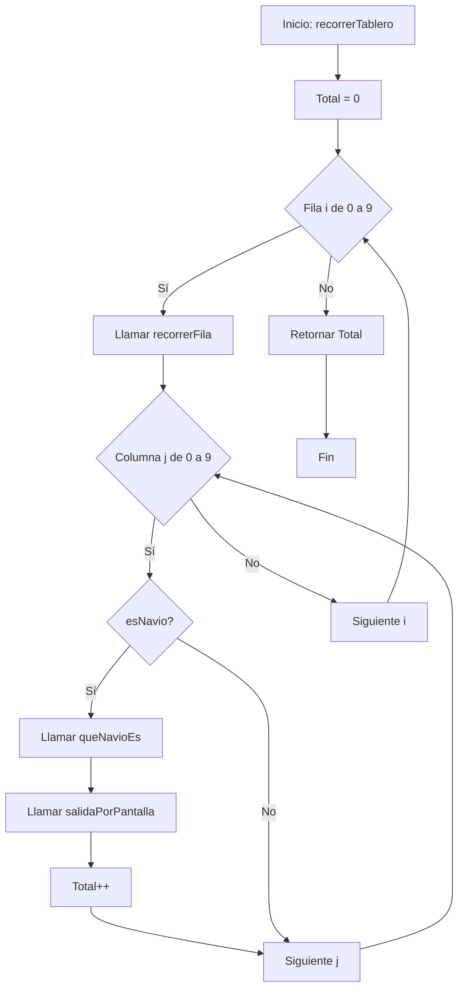

# Primera Actividad: Hundimiento a la Flota en Python

## Parte 1: Programación Estructurada (Repaso)
En esta fase, adaptamos el ejercicio original a Python, mejorando la legibilidad y utilizando funciones con parámetros claros.

### Enunciado
Realiza un programa que recorra un tablero de 10x10. El programa debe identificar qué casillas están ocupadas y de qué barco se trata.

#### Especificaciones:
- **Tablero:** Matriz 10x10 definida en el main.
- **Valores:**
  - 0 (Agua)
  - 1 (Submarino)
  - 2 (Buque)
  - 4 (Portaaviones)
- **Funciones requeridas:**
  - `recorrerTablero(tablero)`: Devuelve el total de partes de naves.
  - `recorrerFila(fila)`: Devuelve el total de partes de naves en una fila.
  - `esNavio(valor)`: Devuelve True si el valor es > 0.
  - `queNavioEs(valor)`: Devuelve el nombre del barco como String.
  - `salidaPorPantalla(coord_x, coord_y, nombre)`: Imprime el resultado.

#### Diagrama de Flujo (Lógica de Recorrido)

---

## Parte 2: El Salto a Objetos

### Título: "Sistemas Complejos: Del Dato al Objeto"

### Objetivos de Aprendizaje
- Identificar entidades (Clases) y sus estados (Atributos).
- Comprender la comunicación entre objetos mediante el Diagrama de Secuencia.
- Implementar lógica de negocio encapsulada.

#### 1. Modelado y Abstracción 
En lugar de ver números en una matriz, definir:
- **Clase Nave:** Atributos (`nombre`, `vida_restante`). Método `recibir_impacto()`.
- **Clase Casilla:** Atributos (`ocupante` -que apunta a un objeto Nave-, `esta_atacada`).
- **Clase Tablero:** Una matriz de objetos Casilla.

#### 2. Diseño: El Diagrama de Secuencia
Diseñar el flujo de un Ataque.
- Dibujar cómo el usuario envía una coordenada al Tablero, cómo este busca la Casilla y cómo la Casilla notifica a la Nave.

#### 3. Implementación en Python
Desarrollar el código base donde:
- Se instancian los barcos.
- Se "vinculan" los barcos a las casillas (una misma instancia de Buque ocupará dos objetos Casilla).
- Se procesan disparos detectando si un barco ha sido hundido (`vida == 0`).

### Tarea Final (solamente realizarla después de acabar el diseño de objetos y secuencia)
> Implementa el método `disparar(x, y)` en la clase Juego. Si la casilla tiene una nave, resta vida a la nave. Si la vida llega a cero, muestra por pantalla: '¡Hundido! Has destruido el [Nombre del Barco]'.
